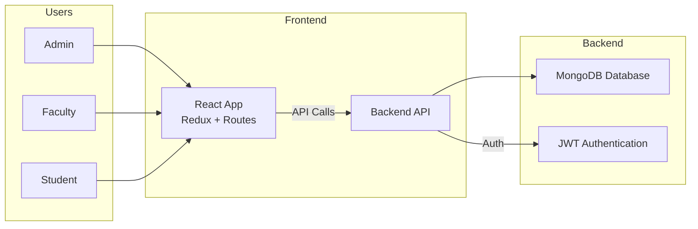
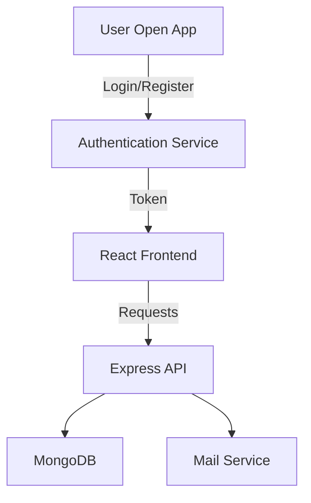
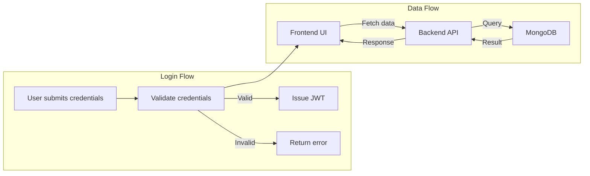
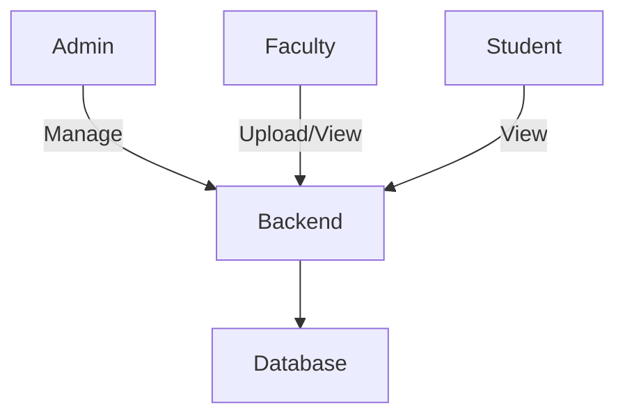

# College Management System (CMS)

A full-stack MERN application for managing college operations across admin, faculty, and student roles.

## Table of Contents

- [Project Overview](#project-overview)
- [Architecture](#architecture)
- [Features](#features)
- [Getting Started](#getting-started)
  - [Prerequisites](#prerequisites)
  - [Backend Setup](#backend-setup)
  - [Frontend Setup](#frontend-setup)
- [Environment Variables](#environment-variables)
- [Project Structure](#project-structure)
- [Scripts](#scripts)
- [How It Works](#how-it-works)
- [Notes](#notes)
- [Contact](#contact)

## Project Overview

The College Management System is built with MongoDB, Express, React, and Node.js. It provides role-based access to manage branches, faculty, students, subjects, exams, notices, timetables, study materials, marks, and profiles.

## Architecture



### High-Level Diagram



## Features

- Admin dashboard for managing:
  - branches
  - faculty
  - students
  - subjects
  - exams
  - notices
  - timetables
  - materials
- Faculty portal:
  - add marks
  - upload materials
  - view timetable
  - manage student performance
- Student portal:
  - view profile
  - view timetable
  - access study resources
  - view marks
- Role-based authentication and authorization
- Password reset with email support

## Getting Started

### Prerequisites

- Node.js 18+ / npm
- MongoDB instance or Atlas cluster

### Backend Setup

1. Change into the backend directory:
   ```bash
   cd backend
   ```
2. Install backend dependencies:
   ```bash
   npm install
   ```
3. Create a `.env` file from `.env.sample` and add required values
4. Start the backend server:
   ```bash
   npm run dev
   ```

### Frontend Setup

1. Change into the frontend directory:
   ```bash
   cd frontend
   ```
2. Install frontend dependencies:
   ```bash
   npm install
   ```
3. Start the React application:
   ```bash
   npm start
   ```

## Environment Variables

Create a `.env` file inside `backend/` with values for:

- `MONGO_URI` - MongoDB connection string
- `JWT_SECRET` - Secret key for JWT tokens
- `EMAIL_USER` - Email account user for sending reset emails
- `EMAIL_PASS` - Email account password or app-specific password

## Project Structure

- `backend/`
  - `index.js` - App entry point
  - `app.js` - Express configuration
  - `controllers/` - Route logic
  - `models/` - MongoDB schemas
  - `routes/` - API endpoints
  - `middlewares/` - Authentication and file upload middleware
  - `utils/` - Response helpers and email utility
- `frontend/`
  - `src/` - React application source
  - `src/components/` - Shared UI components
  - `src/layouts/` - Role-based layout components
  - `src/redux/` - State management
  - `src/Screens/` - Pages for admin, faculty, and student flows

## Scripts

### Backend

- `npm start` - Run the production backend server
- `npm run dev` - Run backend with `nodemon`
- `npm run seed` - Seed initial admin data

### Frontend

- `npm start` - Run React development server
- `npm run build` - Build production assets
- `npm test` - Run test suite

## How It Works



### User Role Flow



## Notes

- Keep `.env` files out of source control.
- Update API base URLs in `frontend/src/baseUrl.js` if the backend is hosted separately.
- Add any deployment or environment-specific notes in this README as the project evolves.

## Contact

For questions or improvements, edit this README or reach out to your project team.
